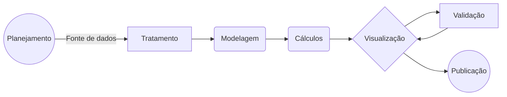

# Etapas de um Projeto no Power BI 

## O início começa com o **Planejamento**. Nesta etapa, definimos os objetivos do projeto, os requisitos dos usuários, os dados necessários e as ferramentas e técnicas que serão utilizadas. É importante realizar uma análise de viabilidade para garantir que o projeto seja possível e viável.

# Tratamento (ETL)

Nesta etapa, os dados são coletados de diferentes fontes e preparados para serem utilizados no Power BI. O processo ETL consiste nas seguintes etapas:

- Conexão e Obtenção dos Dados
- Tratamento e transformação dos dados
- Carregamento dos dados para o modelo 

# Modelagem
Nesta etapa, os dados são organizados de forma a facilitar a análise e a visualização. É importante criar um modelo de dados que seja eficiente e atenda às necessidades dos usuários.  
- Relacionamento das tabelas
- Criação de hierarquias
- Formatação dos dados

# Cálculos

Nesta etapa, criamos cálculos e análises para obter insights a partir dos dados. É importante utilizar as ferramentas e técnicas adequadas para garantir que os resultados sejam precisos e confiáveis.
- Medidas DAX
- Colunas calculadas

# Visualização e Storytelling

Nesta etapa, os resultados dos cálculos e análises são apresentados em relatórios visuais. Os relatórios devem ser claros, concisos e fáceis de entender.
- Gráficos
- Botões
- Interações
- Bookmark
- Temas
- Cores

# Publicação e Compartilhamento

Nesta etapa, os relatórios são compartilhados com os usuários. É importante garantir que os usuários tenham acesso aos relatórios e que possam utilizá-los de forma eficaz.
- Publicação
- Compartilhamento
- Configuração de RLS
- Atualizações automáticas
##

## Fluxo do projeto:

